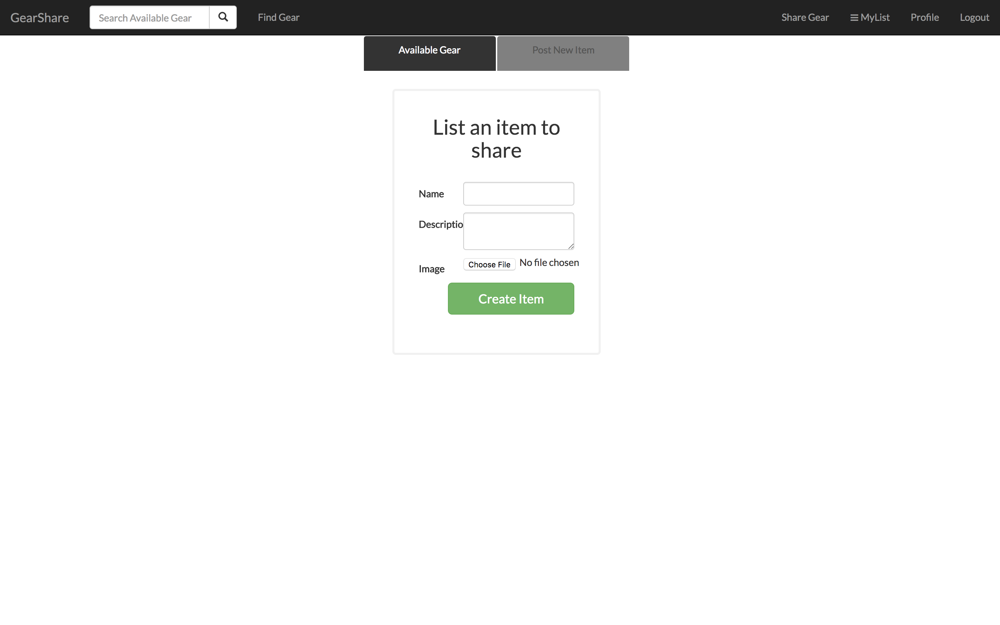
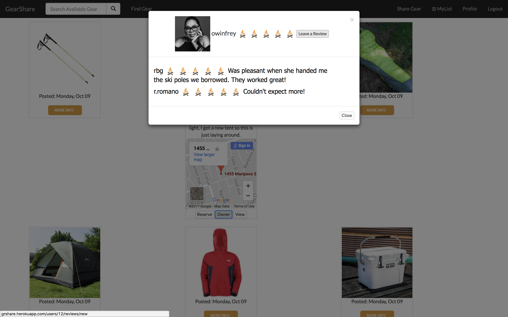
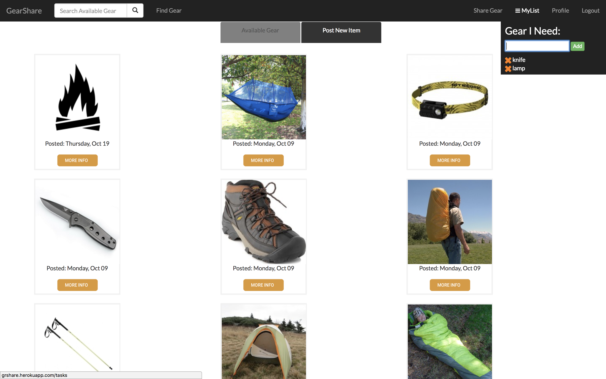

# GearShare

## Description
GearShare is a place where users can find the outdoor equipment items they need for their next outdoor adventure. Users can post items they are willing to share, allowing others to search for and reserve available items. After requests for reservations are approved, the item requester and owner coordinate the item pick up and return.

## Features
This app models design features of popular sharing economy apps including integration of user authentication, image uploading, Google Maps API, email notifications, reviews, search filtering and modern styling.

## Using GearShare

*Figure 1*. The GearShare homepage.

### To Share an Item:

  1. Click 'Share Gear' in the navigation bar
  2. Complete the form with item details, upload an image and click 'Create Item'

*Figure 2*. New gear item to share form.

### To Reserve an Item:

  1. Click 'Find Gear' or enter an item keyword in the search field located in the navigation bar
  2. Click 'MORE INFO' on the desired item and click 'Reserve'
  3. Complete the form with reservation details and click 'Request Reservation'

### To Approve a Reservation:

  1. Click the 'Reserved' tab, click 'approve?' on the requested item and then click 'OK' on the confirmation notice
  2. After the item has been returned, navigate back to the 'Reserved' page and click 'returned?' to make the item available for reservations

### To Leave a Review:

  1. Click 'Find Gear' or enter the item keyword used when the item was reserved in the search field
  2. Click 'MORE INFO' then click the 'Owner' button
  3. Click 'Leave a Review', complete the form with review details and click 'Create Review'

*Figure 3*. Leave a review for an item owner.

### To add and remove an item from 'MyList'

  1. 'MyList' is a convenient feature to keep track of items that need to be reserved. To add an item, simply click 'MyList', type the name of item and click 'Add'.
  2. To remove the item click the orange 'x' that appears left of the listed item.

*Figure 4*. Add or remove items from 'MyList'.

## Install GearShare locally

  1. Ensure the latest version of Rails is installed
  2. Fork the GearShare repository to your GitHub account
  3. Clone the repository in your account to your computer
  4. Acquire and place the following in an env file located in the root folder:
    - Amazon Web Services API key
    - S3 API key
    - Valid email account information including the address and username

## Challenges
One of the biggest challenges we faced was learning and implementing Bootstrap. The team had limited experience with front-end frameworks and found Bootstrap to be flexible and less heavy-handed for the scope of our application. We had fun exploring Bootstrap's grid layout system and styles to set up elements including the navigation bar, modals and tabs. The end result is a more responsive and modern looking application.

Another challenge was planning and executing features within a limited amount of time. This was one of the few projects where as a group we would determine the features and purpose of the application versus Dev Bootcamp providing that structure to us. We had to be observant of time-constraints as well as ensuring that core features were completed before deciding to add another feature. We were ambitious in the beginning, but became more focused in our approach to delivering a final product. Our experience highlighted the importance of maintaining good product management workflow and communication while under pressure.

## Next Steps
The first step would be to develop a feature that would provide an incentive for users to return borrowed items to owners. Currently, the application relies on a honor-system to share and return items. Options for this feature include requiring valid user credit card information on sign-up or a token-system, where a limited number of tokens are provided to users and are exchanged with each approved item reservation.

Another step would be to add filtering item searches by proximity to user. We would also like to enhance the 'MyList' feature so that it would provide a suggested items list based on a user's trip destination.

## The Team

  - Team Members: Michael McDonald([miker-mcd](https://github.com/miker-mcd)), David Keller([dckeller](https://github.com/dckeller)) and Daniel Way([dwaypro](https://github.com/dwaypro))